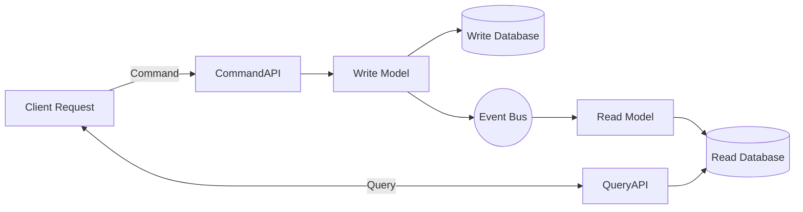
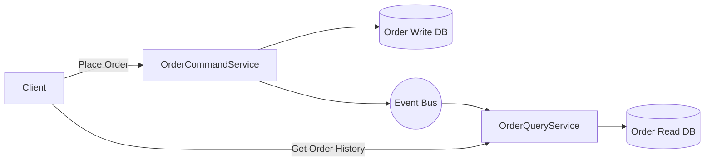

# CQRS (Command Query Responsibility Segregation)

## 1. What is CQRS?
- **CQRS** = **Command Query Responsibility Segregation**.  
- Separates the **read (Query)** and **write (Command)** sides of a system.  
- Instead of a single model handling both reads and writes, you have **two models**:  
  - **Command Model** → Handles state changes (create, update, delete).  
  - **Query Model** → Handles reads (fetch, search, reporting).  

This provides **scalability, flexibility, and optimized models** for different workloads.

---

## 2. Why CQRS?
Traditional CRUD systems use the same data model for both reads and writes.  

- Reads are often **far more frequent** than writes.  
- Different requirements:  
  - Writes need **consistency**.  
  - Reads need **performance** and **flexibility**.  
- In microservices, separating them makes **event-driven architectures** easier.  

---

## 3. How It Works
1. **Command Side (Write model)**  
   - Receives commands like `CreateOrder`, `UpdateInventory`, `RegisterDevice`.  
   - Validates business rules.  
   - Persists changes to the **write database**.  
   - Publishes **events** (e.g., `OrderCreated`, `InventoryUpdated`).  

2. **Query Side (Read model)**  
   - Listens to events.  
   - Updates a **read-optimized database** (denormalized, cached, or even multiple stores).  
   - Clients query the read DB for fast responses.  

👉 Write = strict business rules.  
👉 Read = optimized for queries.  

---

## 4. Example

### 📌 E-commerce
- **Command**: `PlaceOrder` → Order DB → event `OrderPlaced`.  
- **Query**: UI queries a **read DB** (pre-joined tables or NoSQL store) to quickly render order history.  

### 📌 IoT Platform
- **Command**: `RegisterDevice` → Device DB → event `DeviceRegistered`.  
- **Query**: Dashboard queries a read DB for aggregated telemetry stats.  

---

## 5. Benefits
- ✅ **Scalability** – read and write sides scale independently.  
- ✅ **Performance** – optimized read models (denormalized, cached).  
- ✅ **Flexibility** – different storage for reads vs writes.  
- ✅ **Event-driven** – integrates well with Event Sourcing & Sagas.  

---

## 6. Challenges
- ⚠️ **Complexity** – two models to maintain.  
- ⚠️ **Eventual consistency** – read side may lag behind write side.  
- ⚠️ **Infrastructure overhead** – requires messaging/event system.  
- ⚠️ **Not always necessary** – overkill for simple CRUD apps.  

---

## 7. Diagram

---

## 8. CQRS vs CRUD

| Feature              | CRUD (Traditional)          | CQRS                           |
|-----------------------|-----------------------------|--------------------------------|
| **Model**            | Single data model           | Separate read & write models   |
| **Consistency**       | Strong (ACID)               | Eventual consistency           |
| **Performance**       | Reads may be slow           | Reads optimized                |
| **Scalability**       | Single DB bottleneck        | Independent scaling            |
| **Complexity**        | Simple                      | Higher                         |

---

## 9. CQRS and the Order Service

### Do We Need Two Microservices for Order?
- **Not necessarily.**  
- CQRS separates **models**, not necessarily **services**.  

You have two main approaches:

### ✅ Option A: Single Microservice
- Both Command API (writes) and Query API (reads) live inside the same Order Service.  
- Still has separate **write model** and **read model/databases**.  
- Best for smaller systems.  

### ✅ Option B: Two Microservices (Order Command + Order Query)
- One microservice handles **commands** (create, update, cancel).  
- Another handles **queries** (order history, dashboards).  
- Communicate via **events** (Kafka, RabbitMQ, etc.).  
- Best for large-scale systems.  

---

### Trade-offs

| Approach | Pros | Cons |
|----------|------|------|
| **Single Service** | Simpler deployment, fewer moving parts | Less flexibility, may bottleneck at scale |
| **Two Services** | Independent scaling, polyglot persistence, clear separation | More complex, distributed events needed |

---

## 10. Example: E-commerce Order with CQRS

- **OrderCommandService**: Creates/updates orders, enforces business rules.  
- **OrderQueryService**: Reads from a denormalized, fast read DB.  

---

## ✅ Summary
- **CQRS** = Split read & write models.  
- You can implement in **one microservice** or split into **two (Command + Query)** for scale.  
- Works well with **Event Sourcing and Saga Pattern**.  
- Trade-off: **eventual consistency** and **added complexity**.  
