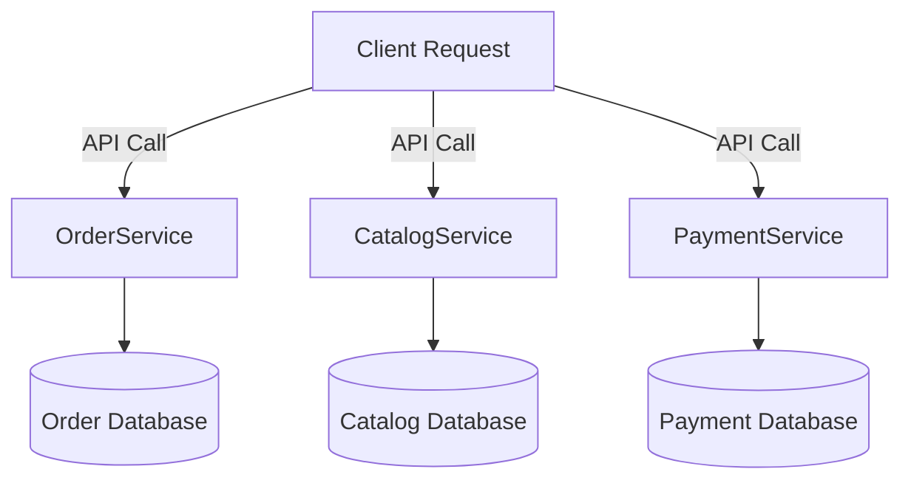

# Database per Service Pattern

## 1. What is “Database per Service”?
In a **microservices architecture**, each service owns **its own database**.  

- No shared database schema across services.  
- A service is the **sole owner** of its data.  
- Other services cannot access its database directly — they communicate via APIs or events.  

This enforces **loose coupling** and **independent scalability**.

---

## 2. Why Database per Service?
- **Autonomy** → Each team can design, scale, and evolve its database without breaking others.  
- **Decoupling** → Service boundaries are clean; changes in one DB won’t affect others.  
- **Polyglot Persistence** → Different services can use the best database for their needs (SQL, NoSQL, Time-series, Graph, etc.).  
- **Fault Isolation** → One failing DB won’t bring down the whole system.  

---

## 3. Example

### 📌 E-commerce
- **Order Service** → relational DB (PostgreSQL) for ACID transactions.  
- **Catalog Service** → NoSQL DB (MongoDB) for flexible product metadata.  
- **Search Service** → Elasticsearch for full-text search.  
- **Payment Service** → specialized secure DB (PCI-compliant).  

### 📌 IoT Platform
- **Device Management Service** → SQL DB for device registry.  
- **Telemetry Service** → Time-series DB (InfluxDB, Timescale) for sensor data.  
- **Alerts Service** → Document DB for flexible alert rules.  

---

## 4. Benefits
- ✅ Independent scaling (Telemetry DB can scale separately).  
- ✅ Resilience – one DB outage won’t stop all services.  
- ✅ Technology freedom (mix of SQL, NoSQL, Graph DB).  
- ✅ Enforces **true service ownership** of data.  

---

## 5. Challenges
- ⚠️ **Data consistency** → No global ACID transactions. Must use **eventual consistency**.  
- ⚠️ **Cross-service queries** → Can’t join across services. Need API composition, data duplication, or aggregators.  
- ⚠️ **Complexity** → More moving parts (backups, monitoring, scaling).  
- ⚠️ **Reporting/Analytics** → Must aggregate DBs into a data warehouse.  

---

## 6. How to Handle Data Consistency?
- **Event-Driven Architecture** → Services publish events (`OrderPlaced`, `PaymentProcessed`), others react.  
- **Saga Pattern** → Distributed transactions with local steps + compensations.  
- **CQRS** → Separate read/write models, build read-optimized views.  

---

## 7. Diagram

---

## ✅ Summary
- **Database per Service** = Each microservice owns and manages its own database.  
- Brings **autonomy, decoupling, resilience, polyglot persistence**.  
- Challenges: distributed transactions, consistency, cross-service queries.  
- Solved with **event-driven designs, sagas, and CQRS**.  
