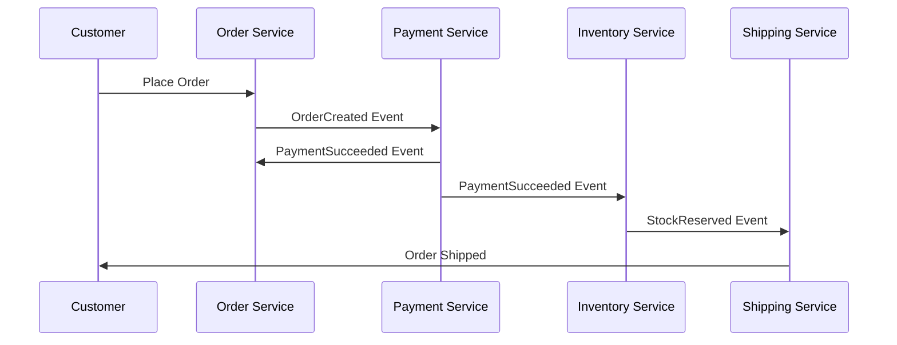
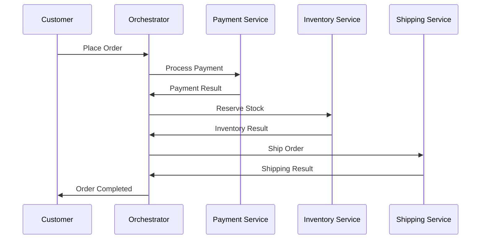
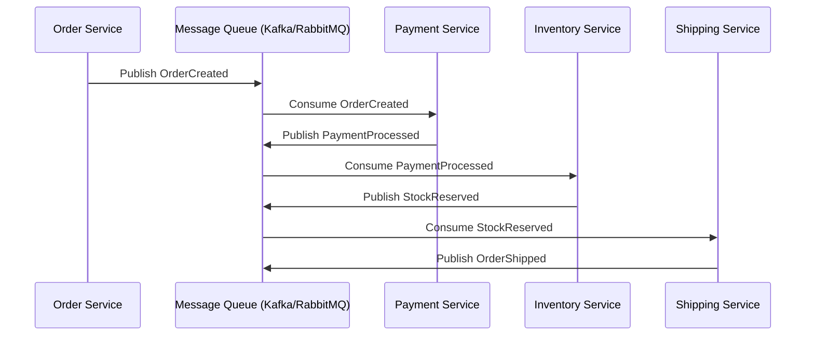

# Saga Pattern (Distributed Transactions)

## 1. The Problem
- In monoliths, a single database transaction can span multiple tables → ACID guarantees.  
- In microservices, each service has its own database (**Database per Service**).  
- A single business process (e.g., placing an order) may touch multiple services/databases.  
- Global transactions across services are hard due to:
  - Different DB technologies.  
  - Network failures.  
  - Scalability concerns.  

👉 The **Saga Pattern** solves this.

---

## 2. What is the Saga Pattern?
A **Saga** is a **sequence of local transactions** across services.  
- Each local transaction updates its own database and then publishes an **event**.  
- The next service listens for that event and executes its own local transaction.  
- If one transaction fails → the saga triggers **compensating transactions** to undo previous changes.  

👉 Guarantees **eventual consistency** instead of strong ACID.

---

## 3. Saga Execution Models

### 1. Choreography (Event-driven)
- Each service listens to events and reacts.  
- No central coordinator.  

**Example:**  
1. `Order Service` → creates order, emits `OrderCreated`.  
2. `Payment Service` → processes payment, emits `PaymentProcessed`.  
3. `Inventory Service` → reserves stock, emits `StockReserved`.  
4. `Shipping Service` → ships item.  

If payment fails → `Order Service` receives `PaymentFailed` and cancels order.  

✅ Simple, decentralized  
⚠️ Harder to manage/debug complex flows  

### 2. Orchestration (Coordinator)
- A central **Saga Orchestrator** coordinates the workflow.  
- Orchestrator tells each service what to do next.  

**Example:**  
1. Orchestrator → tells `Payment Service` to process payment.  
2. If success → tells `Inventory Service` to reserve stock.  
3. If success → tells `Shipping Service` to ship.  
4. If failure → orchestrator issues compensating actions.  

✅ Centralized control, easier to manage  
⚠️ Orchestrator can become a bottleneck  

---

## 4. Example – E-commerce Order

### Choreography Flow

### Orchestration Flow

---

## 5. Benefits
- ✅ Works across different services/databases.  
- ✅ No need for distributed ACID transactions.  
- ✅ Enables **eventual consistency**.  
- ✅ Resilient – supports compensation/rollback.  

---

## 6. Challenges
- ⚠️ More complex than traditional transactions.  
- ⚠️ Requires careful design of compensating actions.  
- ⚠️ Debugging sagas can be difficult.  
- ⚠️ Eventual consistency may not suit all use cases.  

---

## ✅ Summary
- **Saga Pattern** = distributed transaction solution for microservices.  
- Two styles: **Choreography (event-driven)** or **Orchestration (coordinator)**.  
- Ensures **eventual consistency** with **compensating transactions**.  
- Ideal for **e-commerce orders, IoT workflows, booking systems**.

# Saga Pattern and Messaging Queues

## 1. Does Saga Require a Message Queue?
- **No, it’s not mandatory** — but **it’s very common**.  
- Saga is a **pattern**, not a technology. It only defines **how distributed transactions are managed** (choreography or orchestration).  
- Implementation options:  
  - **Messaging-based** (Kafka, RabbitMQ, AWS SQS/SNS, Azure Service Bus).  
  - **HTTP/REST** calls.  
  - **gRPC** or other RPC protocols.  

---

## 2. Why Messaging Queues Are Common in Sagas
1. **Asynchronous communication** → services don’t block.  
2. **Reliability** → messages retried if delivery fails.  
3. **Decoupling** → services don’t need to know each other’s addresses.  
4. **Ordering guarantees** → Kafka ensures ordered streams.  
5. **Event replay** → useful for debugging and rebuilding state.  

---

## 3. Choreography with Messaging Queue
- Services **publish events** to a topic/queue.  
- Other services **subscribe** and react.  

**Example:**  
- `OrderService` → publishes `OrderCreated`.  
- `PaymentService` → consumes and publishes `PaymentProcessed`.  
- `InventoryService` → consumes and publishes `StockReserved`.  
- `ShippingService` → consumes and publishes `OrderShipped`.  

---

## 4. Orchestration with Messaging Queue
- Orchestrator controls the workflow, but uses queue messages.  

**Example:**  
- Orchestrator → sends `ProcessPayment` to queue.  
- `PaymentService` consumes → sends back `PaymentResult`.  
- Orchestrator then continues workflow.  

---

## 5. Without Messaging Queue
- Possible with **HTTP/gRPC** calls.  
- Simpler for small flows.  
- But leads to:  
  - ⚠️ Tight coupling.  
  - ⚠️ Higher risk of cascading failures.  
  - ⚠️ No built-in retries/durability.  

---

## 6. Flow Diagram with Messaging Queue

---

## ✅ Summary
- Saga does **not require** a message queue, but messaging is the **most natural fit**.  
- With queue: **reliability, decoupling, scalability**.  
- Without queue: **tight coupling, brittle flows**.  
