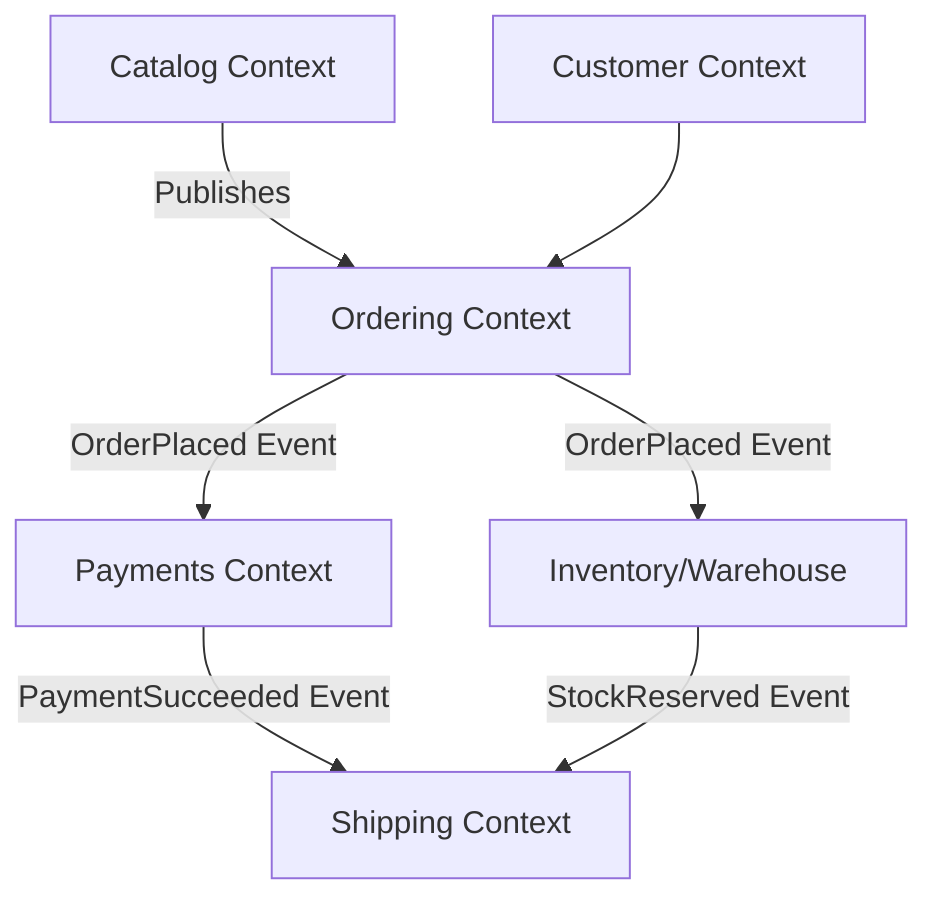
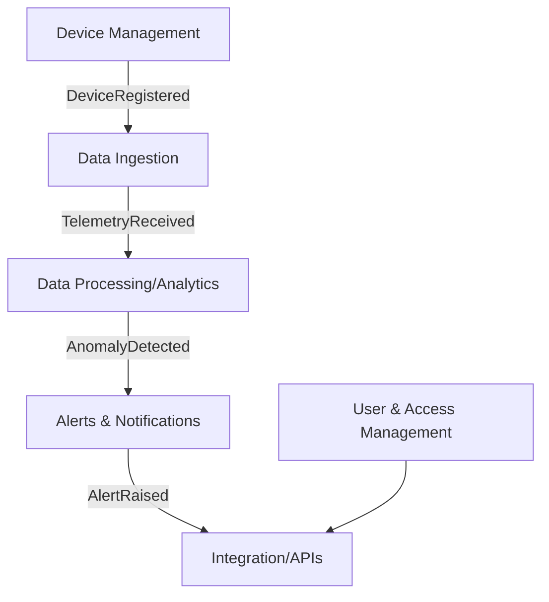
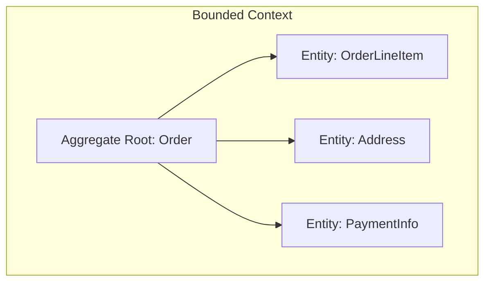

DDD = Domain-Driven Design → a way of designing software around the business domain.

# Domain-Driven Design (DDD) in E-commerce vs IoT Data Platform

## 1. DDD in an E-commerce Site

### Bounded Contexts
In an e-commerce system, the domain is usually broad, so DDD helps divide it into bounded contexts, for example:
- **Catalog** – managing product data, descriptions, categories, and search.
- **Ordering** – shopping cart, checkout, order lifecycle.
- **Payments** – payment processing, fraud checks, refunds.
- **Customer Management** – user accounts, profiles, loyalty programs.
- **Inventory/Warehouse** – stock levels, reservations, fulfillment.
- **Shipping** – carriers, tracking, delivery.

Each bounded context has its own domain model and ubiquitous language. For example, the word *“order”* might mean different things:
- In the **Ordering** context: a customer’s purchase request.
- In the **Warehouse** context: a fulfillment task to pick and pack items.

### Aggregates and Entities
- **Order Aggregate** → Root: `Order`, with line items, totals, and state transitions (e.g., Created → Paid → Shipped).
- **Product Aggregate** → Root: `Product`, which references stock, pricing, and catalog metadata.

### Event-Driven Communication
- **Domain Events** (e.g., `OrderPlaced`, `PaymentSucceeded`, `ItemShipped`) flow across bounded contexts.
- Ensures consistency and decoupling between teams (e.g., the Ordering context doesn’t directly update Shipping—it emits events).

---

### E-commerce Diagram

---

## 2. DDD in an IoT Data Platform

### Bounded Contexts
IoT platforms deal more with data ingestion, processing, and analytics, but DDD is still useful. Typical bounded contexts:
- **Device Management** – onboarding devices, firmware updates, configuration.
- **Data Ingestion** – receiving telemetry, validating, and storing raw streams.
- **Data Processing/Analytics** – aggregations, anomaly detection, AI/ML pipelines.
- **Alerts & Notifications** – raising alerts when thresholds are crossed.
- **User & Access Management** – roles, permissions, security.
- **Integration/External APIs** – exposing data to external systems.

### Aggregates and Entities
- **Device Aggregate** → Root: `Device`, with properties like ID, type, status, firmware version.
- **Data Stream Aggregate** → Root: `Stream`, with metadata about source, schema, and processing rules.
- **Alert Aggregate** → Root: `Alert`, with conditions, status, and history.

### Domain Events
- `DeviceRegistered`, `TelemetryReceived`, `FirmwareUpdated`, `AnomalyDetected`.

---

### IoT Platform Diagram

---

## 3. Key Differences

| Aspect             | E-commerce                        | IoT Data Platform                  |
|--------------------|-----------------------------------|------------------------------------|
| Focus              | Business workflows                | Data flows and device lifecycle    |
| Core Models        | Orders, payments, shipping        | Devices, telemetry, alerts         |
| Event Examples     | `OrderPlaced`, `PaymentSucceeded` | `TelemetryReceived`, `AnomalyDetected` |
| System Nature      | Transaction-centric               | Data-centric, high-volume streams  |

---

## 4. Common DDD Principles in Both
- **Ubiquitous Language** → ensures business stakeholders, developers, and data teams all mean the same thing when they say *order*, *device*, or *event*.
- **Bounded Contexts** → prevent large, messy monoliths by creating focused models.
- **Event-Driven Design** → supports decoupling and scalability.

✅ In short:  
- In **e-commerce**, DDD models **business workflows** (orders, payments, shipping).  
- In **IoT platforms**, DDD models **data flows and device lifecycles** (devices, telemetry, alerts).  

# Domain-Driven Design (DDD) in E-commerce vs IoT Data Platform

## 1. DDD in an E-commerce Site

### Bounded Contexts
In an e-commerce system, the domain is usually broad, so DDD helps divide it into bounded contexts, for example:
- **Catalog** – managing product data, descriptions, categories, and search.
- **Ordering** – shopping cart, checkout, order lifecycle.
- **Payments** – payment processing, fraud checks, refunds.
- **Customer Management** – user accounts, profiles, loyalty programs.
- **Inventory/Warehouse** – stock levels, reservations, fulfillment.
- **Shipping** – carriers, tracking, delivery.

Each bounded context has its own domain model and ubiquitous language. For example, the word *“order”* might mean different things:
- In the **Ordering** context: a customer’s purchase request.
- In the **Warehouse** context: a fulfillment task to pick and pack items.

### Aggregates and Entities
- **Order Aggregate** → Root: `Order`, with line items, totals, and state transitions (e.g., Created → Paid → Shipped).
- **Product Aggregate** → Root: `Product`, which references stock, pricing, and catalog metadata.

### Event-Driven Communication
- **Domain Events** (e.g., `OrderPlaced`, `PaymentSucceeded`, `ItemShipped`) flow across bounded contexts.
- Ensures consistency and decoupling between teams (e.g., the Ordering context doesn’t directly update Shipping—it emits events).

---

### E-commerce Diagram

---

## 2. DDD in an IoT Data Platform

### Bounded Contexts
IoT platforms deal more with data ingestion, processing, and analytics, but DDD is still useful. Typical bounded contexts:
- **Device Management** – onboarding devices, firmware updates, configuration.
- **Data Ingestion** – receiving telemetry, validating, and storing raw streams.
- **Data Processing/Analytics** – aggregations, anomaly detection, AI/ML pipelines.
- **Alerts & Notifications** – raising alerts when thresholds are crossed.
- **User & Access Management** – roles, permissions, security.
- **Integration/External APIs** – exposing data to external systems.

### Aggregates and Entities
- **Device Aggregate** → Root: `Device`, with properties like ID, type, status, firmware version.
- **Data Stream Aggregate** → Root: `Stream`, with metadata about source, schema, and processing rules.
- **Alert Aggregate** → Root: `Alert`, with conditions, status, and history.

### Domain Events
- `DeviceRegistered`, `TelemetryReceived`, `FirmwareUpdated`, `AnomalyDetected`.

---

### IoT Platform Diagram

---

## 3. Key Differences

| Aspect             | E-commerce                        | IoT Data Platform                  |
|--------------------|-----------------------------------|------------------------------------|
| Focus              | Business workflows                | Data flows and device lifecycle    |
| Core Models        | Orders, payments, shipping        | Devices, telemetry, alerts         |
| Event Examples     | `OrderPlaced`, `PaymentSucceeded` | `TelemetryReceived`, `AnomalyDetected` |
| System Nature      | Transaction-centric               | Data-centric, high-volume streams  |

---

## 4. Common DDD Principles in Both
- **Ubiquitous Language** → ensures business stakeholders, developers, and data teams all mean the same thing when they say *order*, *device*, or *event*.
- **Bounded Contexts** → prevent large, messy monoliths by creating focused models.
- **Event-Driven Design** → supports decoupling and scalability.

✅ In short:  
- In **e-commerce**, DDD models **business workflows** (orders, payments, shipping).  
- In **IoT platforms**, DDD models **data flows and device lifecycles** (devices, telemetry, alerts).  

---

# Understanding Contexts, Aggregates, and Entities in DDD

## 1. What is a Context?
- In DDD, a **Bounded Context** is a boundary around a domain model where a specific meaning of terms is valid.  
- It is not the same as a service, but often a bounded context maps to a microservice or a group of services.  
- The purpose is to avoid ambiguity when the same word has different meanings in different domains.

**Examples:**
- **E-commerce:**  
  - In the **Ordering Context**, *Order* = a customer’s request to buy something.  
  - In the **Warehouse Context**, *Order* = a fulfillment instruction for shipping items.  

---

## 2. What is an Aggregate?
- An **Aggregate** is a cluster of domain objects (Entities and Value Objects) treated as a **single unit of consistency**.  
- Each aggregate has a **root** (Aggregate Root), which is the only entry point for modifications.  
- Aggregates enforce business rules and invariants.

**Examples:**
- **E-commerce:**  
  - *Order Aggregate* → Root: `Order`, children: `OrderLineItem`, `Address`, `PaymentInfo`.  
  - Rule: An order cannot be placed without at least one line item.  

- **IoT:**  
  - *Device Aggregate* → Root: `Device`, children: `FirmwareVersion`, `Settings`, `TelemetryConfig`.  
  - Rule: A device must have a valid ID before it can send telemetry.  

---

## 3. What is an Entity?
- An **Entity** is an object with a **distinct identity** that persists over time, even if its attributes change.  
- Entities represent more than just data; they encapsulate business rules and behavior.  

**Examples:**
- **E-commerce:** `Order`, `Customer`, `Product` are entities.  
- **IoT:** `Device`, `Alert` are entities.  

---

## 4. Comparison Table

| Concept             | Scope/Definition                   | Example (E-commerce)         | Example (IoT)              |
|---------------------|------------------------------------|------------------------------|-----------------------------|
| **Bounded Context** | Model boundary with specific meaning | Ordering, Payments, Shipping | Device Mgmt, Data Processing |
| **Aggregate**       | Consistency boundary (root + children) | `Order` + line items         | `Device` + settings         |
| **Entity**          | Object with identity               | `Order`, `Customer`, `Product` | `Device`, `Alert`          |

---

## 5. Visual Relationship

- **Context**: The boundary (like "Ordering")  
- **Aggregate**: Order (root) defines consistency rules  
- **Entities**: OrderLineItem, Address, PaymentInfo live inside the aggregate  

---
