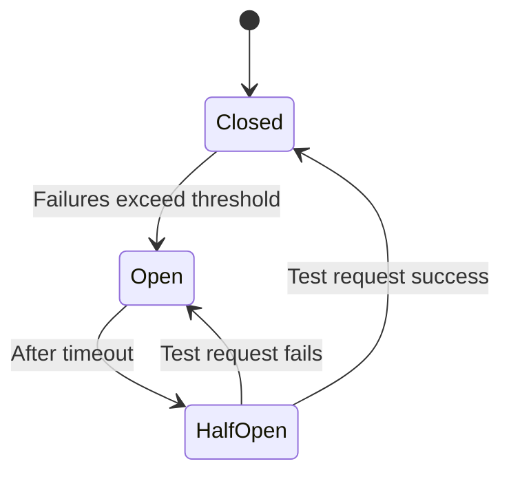

# Circuit Breaker Pattern in .NET

## 1. What is the Circuit Breaker Pattern?
- A **Circuit Breaker** is like an **electrical fuse** for service calls.  
- It prevents your system from **constantly retrying a failing service**, which can cause cascading failures.  
- Instead of hammering a broken service, the circuit **“opens”** after repeated failures and gives it time to recover.  

---

## 2. States of Circuit Breaker
1. **Closed** → Requests flow normally. Failures are counted.  
2. **Open** → Too many failures → Circuit opens → Requests fail immediately (fast fail).  
3. **Half-Open** → After a cooldown period, allow a few test requests.  
   - If they succeed → go back to Closed.  
   - If they fail → stay Open.  

This protects the system and allows **graceful degradation**.

---

## 3. Benefits
- ✅ Prevents cascading failures.  
- ✅ Improves fault tolerance.  
- ✅ Provides fast failure (no waiting for timeouts).  
- ✅ Supports graceful recovery.  

---

## 4. Implementation in .NET

### Install Polly
```bash
dotnet add package Polly
```

### Example: Circuit Breaker with HttpClient
```csharp
using Polly;
using Polly.CircuitBreaker;

var breakerPolicy = Policy
    .Handle<HttpRequestException>() // what exceptions to handle
    .CircuitBreakerAsync(
        exceptionsAllowedBeforeBreaking: 3,    // threshold
        durationOfBreak: TimeSpan.FromSeconds(30),  // open state time
        onBreak: (ex, breakDelay) =>
        {
            Console.WriteLine($"Circuit opened for {breakDelay.TotalSeconds} seconds due to: {ex.Message}");
        },
        onReset: () => Console.WriteLine("Circuit closed. Service recovered."),
        onHalfOpen: () => Console.WriteLine("Circuit in half-open state, testing...")
    );

var httpClient = new HttpClient();

// Usage: Wrap the HTTP call
try
{
    await breakerPolicy.ExecuteAsync(async () =>
    {
        var response = await httpClient.GetAsync("https://example.com/api");
        response.EnsureSuccessStatusCode();
        Console.WriteLine("Request succeeded!");
    });
}
catch (BrokenCircuitException)
{
    Console.WriteLine("Circuit is open! Fast failing...");
}
```

---

## 5. Circuit Breaker + Retry
Often combined with a **Retry Policy** for resilience:
```csharp
var retryPolicy = Policy
    .Handle<HttpRequestException>()  
    .WaitAndRetryAsync(3, retryAttempt => TimeSpan.FromSeconds(retryAttempt));

var combinedPolicy = Policy.WrapAsync(retryPolicy, breakerPolicy);
```

---

## 6. Circuit Breaker in ASP.NET Core with HttpClientFactory
You can configure it at **startup** with **Typed Clients**:
```csharp
builder.Services.AddHttpClient("ExternalApiClient")
    .AddPolicyHandler(Policy
        .Handle<HttpRequestException>()
        .CircuitBreakerAsync(3, TimeSpan.FromSeconds(30)));
```

Then inject and use:
```csharp
public class MyService
{
    private readonly HttpClient _client;
    public MyService(IHttpClientFactory factory)
    {
        _client = factory.CreateClient("ExternalApiClient");
    }

    public async Task<string> GetData()
    {
        var response = await _client.GetStringAsync("/data");
        return response;
    }
}
```

---

## 7. Alternatives
- **YARP (Yet Another Reverse Proxy)** + Polly policies.  
- **Ocelot API Gateway** (supports circuit breaker and retry).  
- **Resilience Middleware** (built-in Polly integration in .NET 8).  

---

## 8. Diagram



---

## ✅ Summary
- **Circuit Breaker** = protect services from repeated failures.  
- In .NET → use **Polly** with HttpClient or ASP.NET Core’s `HttpClientFactory`.  
- States: Closed → Open → Half-Open.  
- Combine with Retry & Timeout for robust microservices.  
