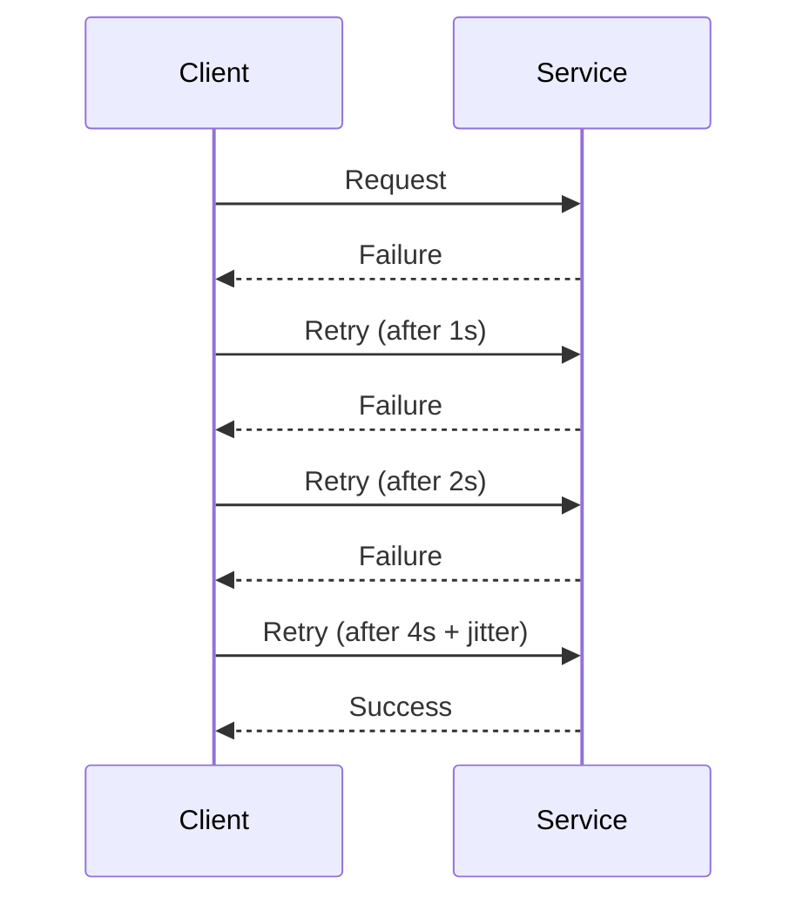

# Retry + Backoff Pattern in .NET

## 1. What is Retry + Backoff?
- **Retry** = When a request fails due to a transient fault (e.g., network glitch, temporary unavailability), the client retries the operation.  
- **Backoff** = Instead of retrying immediately in a tight loop, wait before retrying.  
- This avoids overwhelming a service that is already struggling.  

Typically combined as **Retry with Exponential Backoff**.

---

## 2. Types of Backoff Strategies
1. **Fixed Delay**  
   - Always wait the same time between retries (e.g., 2s, 2s, 2s).  

2. **Linear Backoff**  
   - Waits increase linearly (e.g., 1s, 2s, 3s).  

3. **Exponential Backoff** (most common)  
   - Wait time doubles with each retry (e.g., 1s, 2s, 4s, 8s).  

4. **Exponential Backoff with Jitter**  
   - Add randomness (jitter) to avoid **thundering herd problem** (many clients retrying at the same intervals).  
   - Example: 1–2s, 2–4s, 4–8s.  

---

## 3. Benefits
- ✅ Improves resilience against transient failures.  
- ✅ Reduces load on struggling services.  
- ✅ Helps smooth recovery after outages.  
- ✅ With jitter, avoids synchronized spikes.  

---

## 4. Implementation in .NET with Polly

### Install Polly
```bash
dotnet add package Polly
```

### Retry with Fixed Delay
```csharp
var retryPolicy = Policy
    .Handle<HttpRequestException>()
    .WaitAndRetryAsync(3, _ => TimeSpan.FromSeconds(2)); // retry 3 times, wait 2s each
```

### Retry with Exponential Backoff
```csharp
var retryPolicy = Policy
    .Handle<HttpRequestException>()
    .WaitAndRetryAsync(
        retryCount: 5,
        sleepDurationProvider: attempt => TimeSpan.FromSeconds(Math.Pow(2, attempt)), // 2^n seconds
        onRetry: (exception, delay) =>
        {
            Console.WriteLine($"Retrying after {delay.TotalSeconds}s due to: {exception.Message}");
        });
```

### Retry with Exponential Backoff + Jitter
```csharp
var jitterer = new Random();

var retryPolicy = Policy
    .Handle<HttpRequestException>()
    .WaitAndRetryAsync(
        retryCount: 5,
        sleepDurationProvider: attempt =>
            TimeSpan.FromSeconds(Math.Pow(2, attempt)) +
            TimeSpan.FromMilliseconds(jitterer.Next(0, 1000)), // add jitter
        onRetry: (exception, delay) =>
        {
            Console.WriteLine($"Delaying {delay.TotalSeconds}s before next retry due to: {exception.Message}");
        });
```

---

## 5. Combining Retry + Circuit Breaker
Retries often go hand-in-hand with **Circuit Breaker**:
```csharp
var retryPolicy = Policy
    .Handle<HttpRequestException>()
    .WaitAndRetryAsync(3, attempt => TimeSpan.FromSeconds(Math.Pow(2, attempt)));

var circuitBreakerPolicy = Policy
    .Handle<HttpRequestException>()
    .CircuitBreakerAsync(3, TimeSpan.FromSeconds(30));

var combinedPolicy = Policy.WrapAsync(retryPolicy, circuitBreakerPolicy);
```

---

## 6. Diagram



---

## ✅ Summary
- **Retry** = try again on transient errors.  
- **Backoff** = wait progressively longer before retrying.  
- **Exponential Backoff + Jitter** = best practice for distributed systems.  
- In **.NET**, use **Polly** with `WaitAndRetryAsync`.  
- Combine with **Circuit Breaker** for robust microservices resilience.  
