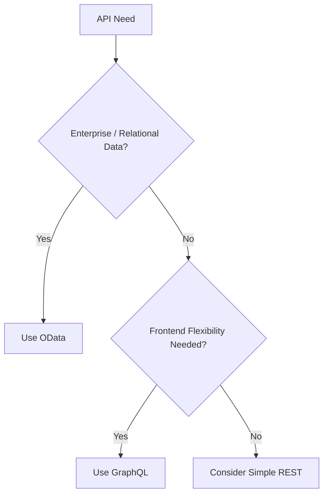

# OData vs GraphQL

## 🔹 OData
- **What it is**: Open Data Protocol, REST-based standard by Microsoft.  
- **Supports**:  
  - Querying: `$filter`, `$select`, `$expand`, `$orderby`, `$top`, etc.  
  - CRUD operations: Not just queries—you can also `POST`, `PUT`, `PATCH`, and `DELETE`.  
- **Style**: URL-driven query language (`/Products?$filter=Price gt 100&$orderby=Name`).  
- **Strengths**:
  - Great when you have a relational/data-service-heavy backend (SQL, SAP, Dynamics, etc.).  
  - Works with existing REST tools, easy to adopt for enterprise integration.  
  - Strong metadata exposure (`$metadata` endpoint).  

---

## 🔹 GraphQL
- **What it is**: Query language for APIs created by Facebook.  
- **Supports**:  
  - Queries (read).  
  - Mutations (create/update/delete).  
  - Subscriptions (real-time updates).  
- **Style**: JSON-like request body (`{ products(filter: { price_gt: 100 }) { name } }`).  
- **Strengths**:
  - Client decides exactly what data it wants—no over-fetching/under-fetching.  
  - Flexible, strongly typed schema.  
  - Works well for aggregating multiple backends.  

---

## 🔹 Key Differences

| Feature | OData | GraphQL |
|---------|-------|---------|
| **Transport** | REST (HTTP + URL params) | Single endpoint, JSON body |
| **Queries** | Strong support, URL syntax | Strong support, JSON-like syntax |
| **Mutations (CUD)** | Supported via HTTP verbs (`POST`, `PATCH`) | First-class `mutation` concept |
| **Subscriptions / Realtime** | Not native | Built-in (`subscription`) |
| **Over/under-fetching** | Possible (fixed response schema) | Avoided (client controls fields) |
| **Tooling / Ecosystem** | Strong in Microsoft/enterprise ecosystems | Huge ecosystem (Apollo, Relay, Hasura, etc.) |
| **Learning Curve** | Easier if familiar with REST | Steeper, but more flexible |

---

## 🍴 Analogy: Restaurant Menu vs. À la Carte Ordering

- **OData = Restaurant Menu (fixed combos)**  
  - You can **filter** (no pickles, large fries, etc.).  
  - You can **choose a combo** (endpoint + `$filter`, `$select`).  
  - But you’re still bound by the menu structure.  

- **GraphQL = À la Carte Ordering**  
  - You say: *“I want just a burger patty, no bun. Add sweet potato fries, and give me the drink name but not its price.”*  
  - You pick **exactly what you want** and in what shape, all in one request.  

---

## 💼 Real-World Use Cases

### 🔹 When to Use OData
1. **Enterprise/ERP Systems**  
   - Microsoft Dynamics, SAP, and Azure expose data as OData.  
   - Example: Fetching employee records with filters (`/Employees?$filter=Department eq 'HR'`).  

2. **Data Services / Reporting APIs**  
   - BI tools (like Power BI, Tableau) can directly connect to OData feeds.  
   - Example: `/Sales?$filter=Year eq 2024&$select=Product,Revenue`.  

3. **CRUD on Data Entities**  
   - Example: `POST /Products`, `PATCH /Products(123)`, `DELETE /Products(123)`  

### 🔹 When to Use GraphQL
1. **Modern Frontend Apps (React, Angular, Mobile)**  
   - Example: `{ product { id, name, price, reviews { rating } } }`.  

2. **API Gateway / Aggregation**  
   - Example: A travel site fetching from **Flights API + Hotels API + Car Rentals API** via one query.  

3. **Real-time Applications**  
   - Example: `subscription { messages }` for chat or dashboards.  

4. **Mobile Devices (limited bandwidth)**  
   - Example: `{ product { name, thumbnail } }`.  

---

## ⚖️ Quick Decision Guide
- **If your backend is enterprise/data-heavy, standardized, and tool-driven → OData.**  
- **If your frontend is dynamic, client-driven, or needs aggregation/flexibility → GraphQL.**  

---

## 🔄 Flowchart

---

