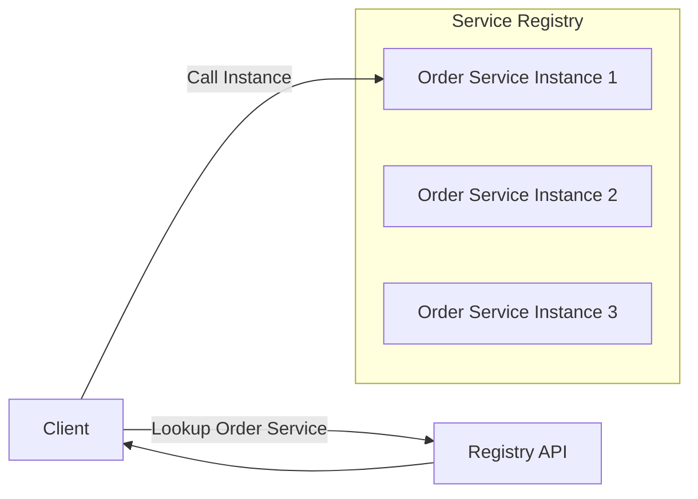

# Service Discovery in Microservices

## 1. What is Service Discovery?
- In microservices, services are **dynamic**: they scale up/down, restart, or move across hosts/containers.  
- Clients (or other services) need a way to **find the current location (IP + port)** of a service.  
- **Service Discovery** = the mechanism by which services **automatically register themselves** and **other services find them**.  

👉 It’s like a **phonebook for microservices**.

---

## 2. Why Do We Need Service Discovery?
Without it:  
- Services would need **hardcoded IPs/ports**, which break in dynamic environments.  
- Scaling (adding more instances) becomes painful.  
- Failures cannot be handled automatically.  

With it:  
- Services are **discoverable dynamically**.  
- Load balancing and failover become possible.  
- Enables **resilient, elastic architectures**.

---

## 3. Types of Service Discovery

### 1. Client-Side Discovery
- The **client** queries a service registry to find available service instances.  
- Client then chooses one (often using a load-balancing algorithm).  

**Flow:**  
1. Service registers itself in **Service Registry**.  
2. Client asks the registry → gets list of healthy instances.  
3. Client calls one instance directly.  

**Examples:** Netflix Eureka, Consul, Zookeeper.  

---

### 2. Server-Side Discovery
- The **client** calls a fixed endpoint (e.g., API Gateway or Load Balancer).  
- The **server-side component** (gateway or LB) queries the registry and routes the request.  

**Flow:**  
1. Service registers with registry.  
2. Client sends request → Gateway/Load Balancer.  
3. Gateway queries registry → forwards to healthy service instance.  

**Examples:** AWS Elastic Load Balancer, Nginx + Consul, Kubernetes Services.  

---

## 4. Service Registry
At the heart of Service Discovery is the **Service Registry**:
- A **database of services and their instances**.  
- Provides APIs for:
  - **Register** → service adds itself when starting.  
  - **Deregister** → remove when shutting down.  
  - **Health check** → remove unhealthy instances.  
  - **Lookup** → find service instances.  

**Popular Service Registries**:
- **Consul** (HashiCorp)  
- **Eureka** (Netflix OSS)  
- **etcd** (used by Kubernetes)  
- **Zookeeper** (Apache)  

---

## 5. Service Discovery in Kubernetes
Kubernetes has **built-in service discovery**:
- Each service gets a **DNS name** (`orderservice.default.svc.cluster.local`).  
- kube-dns/CoreDNS resolves service names to the right pod IPs.  
- Load balancing handled internally.  

👉 You don’t need external Eureka/Consul in Kubernetes (though you *can* use them for advanced setups).

---

## 6. Diagram

---

## 7. Benefits
- ✅ Decouples clients from hardcoded addresses.  
- ✅ Enables auto-scaling and elasticity.  
- ✅ Supports load balancing + failover.  
- ✅ Works with both client-side and server-side discovery.  

---

## 8. Challenges
- ⚠️ Adds complexity (must maintain registry).  
- ⚠️ Registry must be **highly available**.  
- ⚠️ Security → need to ensure only trusted services register.  

---

## ✅ Summary
- **Service Discovery** = dynamic lookup of service instances in a distributed system.  
- Implemented via a **Service Registry** (Eureka, Consul, etc.).  
- Can be **client-side** or **server-side**.  
- In **Kubernetes**, built-in DNS-based discovery simplifies this.  
